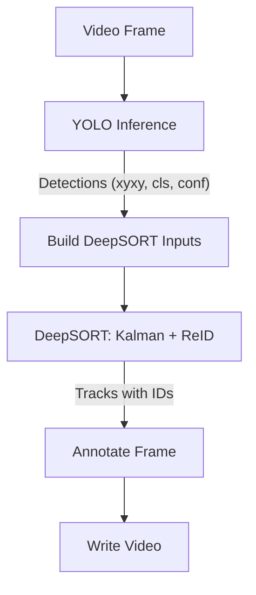
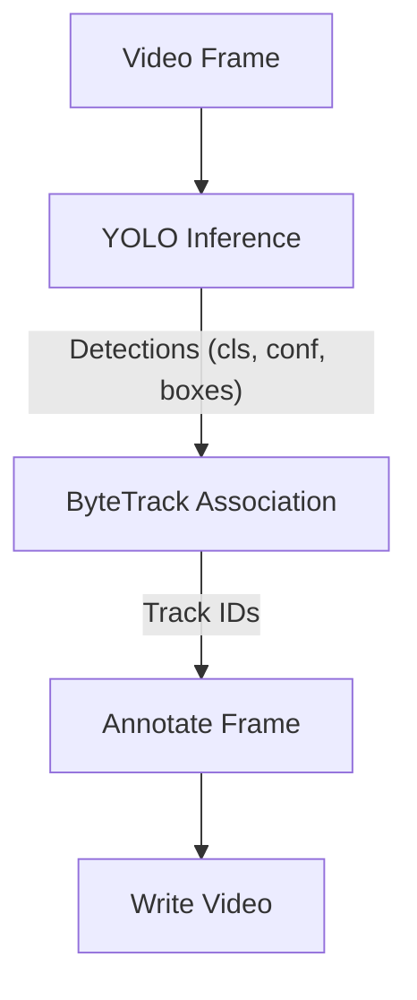

## AI Vision Tracking: YOLO + DeepSORT and ByteTrack

This project demonstrates object detection with YOLO and multi-object tracking using two trackers:
- DeepSORT
- ByteTrack

It includes two runnable scripts:
- `deepsort.py` — YOLO + DeepSORT pipeline
- `bytetrack.py` — YOLO + ByteTrack pipeline

This document covers setup, usage, architecture, diagrams, tuning, and a comparison between ByteTrack and DeepSORT.

### Contents
- Prerequisites
- Quick start
- Project structure
- How it works
  - YOLO + DeepSORT pipeline
  - YOLO + ByteTrack pipeline
- ByteTrack vs DeepSORT: Key differences
- Configuration (`tracker/bytetrack.yaml`)
- Troubleshooting & tips
- License and author

### Prerequisites
- Python 3.9+ (tested with Python 3.11)
- NVIDIA GPU + CUDA drivers (optional but recommended)
- Packages: `ultralytics`, `opencv-python` (or `opencv-python-headless`), `deep-sort-realtime`, `torch`

Install dependencies (headless OpenCV is recommended for servers/WSL):
```bash
python3 -m pip install --upgrade pip
python3 -m pip install ultralytics opencv-python-headless deep-sort-realtime torch torchvision torchaudio
```

Verify GPU availability:
```python
import torch
print('CUDA available:', torch.cuda.is_available())
```

### Quick start
- Place your YOLO weights in `model/` (default `yolo11n.pt`).
- Place your input video in `video/` (default `highway.mp4`).

Run DeepSORT pipeline:
```bash
python3 deepsort.py
```
Output: `tracked_deepsort.mp4` in the repo root.

Run ByteTrack pipeline:
```bash
python3 bytetrack.py
```
Output: `tracker_bytetrack.mp4` in the repo root.

### Project structure
```text
.
├── bytetrack.py                # YOLO + ByteTrack tracker
├── deepsort.py                 # YOLO + DeepSORT tracker
├── model/                      # YOLO weights (e.g., yolo11n.pt)
├── tracker/                    # Tracker configs (e.g., bytetrack.yaml)
├── video/                      # Input videos (e.g., highway.mp4)
└── README.md
```

### How it works
YOLO performs per-frame object detection. A tracker consumes detections across frames to maintain consistent track IDs.

#### YOLO + DeepSORT pipeline
DeepSORT uses motion (Kalman Filter) + appearance (ReID embeddings) to associate detections across frames. It is robust to appearance changes and moderate occlusions but has an overhead for computing embeddings.



DeepSORT input format (per detection):
- `([x1, y1, x2, y2], confidence, class_id)` or `([x, y, w, h], confidence, class_id)` depending on your tracker config. Convert tensors to plain floats before passing.

#### YOLO + ByteTrack pipeline
ByteTrack is a data association method that uses both high-confidence and low-confidence detections for more resilient tracking without an appearance model.



Ultralytics integration pattern:
```python
for r in model.track(source=VIDEO, tracker=CFG, persist=True, stream=True):
    # Persistent tracker state across frames
    # IDs available via r.boxes.id
```

### ByteTrack vs DeepSORT: Key differences
- **Association cues**:
  - **DeepSORT**: motion + appearance (ReID embeddings)
  - **ByteTrack**: motion + two-threshold association (uses low-confidence detections)
- **Embeddings**:
  - **DeepSORT**: computes embeddings (slower, robust to appearance changes)
  - **ByteTrack**: no embeddings (faster, fewer dependencies)
- **Occlusion handling**:
  - **DeepSORT**: appearance helps re-associate after occlusion
  - **ByteTrack**: leverages low-confidence detections to bridge gaps
- **Throughput**:
  - **DeepSORT**: lower FPS (embedding inference overhead)
  - **ByteTrack**: generally higher FPS
- **Tuning surface**:
  - **DeepSORT**: ReID model/device, metric thresholds
  - **ByteTrack**: confidence thresholds, buffer, match threshold

Summary table:

| Aspect                 | DeepSORT                           | ByteTrack                       |
|------------------------|------------------------------------|----------------------------------|
| Appearance model       | Yes (ReID)                        | No                               |
| Speed                  | Medium / Low                      | High                             |
| Occlusion robustness   | Good (appearance)                 | Good (low-conf bridging)         |
| Dependencies           | More (embedding model)            | Fewer                            |
| Typical use-cases      | Small/medium scenes, re-id needed | Crowded scenes, high throughput  |

### Configuration (`tracker/bytetrack.yaml`)
Recommended starting config:
```yaml
tracker_type: bytetrack
track_high_thresh: 0.5
track_low_thresh: 0.1
new_track_thresh: 0.6
track_buffer: 30
frame_rate: 30
match_thresh: 0.8
fuse_score: true
mot20: false
```
Notes:
- `new_track_thresh` too high prevents track creation; start around 0.6.
- `fuse_score` should be boolean for Ultralytics’ ByteTrack integration.
- A `reid` block is unused by ByteTrack (DeepSORT uses embeddings).

### Troubleshooting & tips
- **No GUI in environment**: use `opencv-python-headless` and write videos to disk.
- **IDs always -1 / None**:
  - Use the streaming tracker over the entire video: `model.track(source=..., persist=True, stream=True)`.
  - Lower `new_track_thresh`; verify `track_high/low_thresh`.
  - Ensure `frame_rate` in config is set (~30) to match your input.
- **DeepSORT input errors**:
  - Convert tensors to floats before passing tracker inputs.
  - Draw rectangles with two points `(x1,y1)` and `(x2,y2)`.
- **GPU usage**:
  - Move model to CUDA: `model = YOLO(weights).to('cuda')` if available.
  - Print check: `print(next(model.model.parameters()).device)`.

### License and author
This demo is for educational purposes.

Signed,

Emi Roberti
